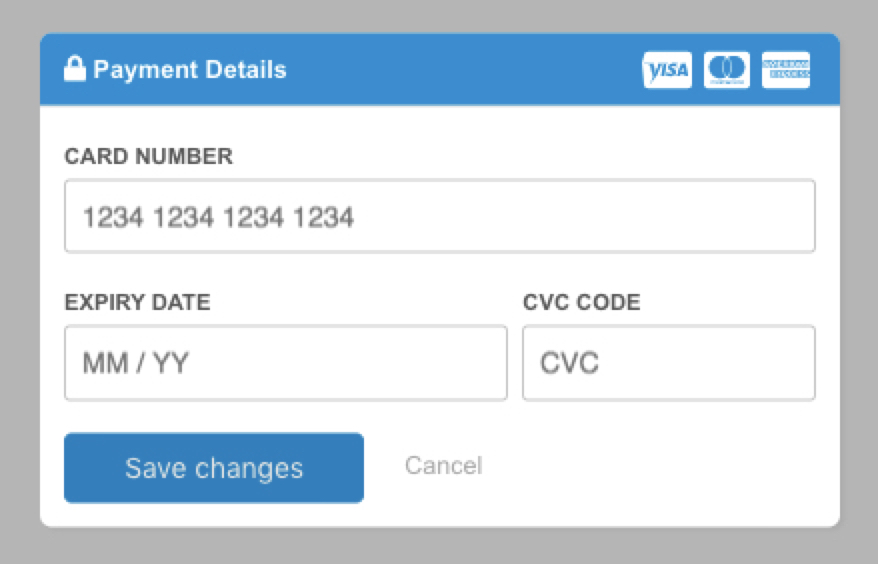

[](https://forthebadge.com) [](https://forthebadge.com)

# react-recurly-modal

<p align="center"></p>

# How to use

Make sure to include the recurly api
```html
<script src="https://js.recurly.com/v4/recurly.js" async></script>
```

## Sample Usage

```javascript
import React from 'react';
import { render } from 'react-dom';
import ReactRecurlyModal from './index';

class MyComponent extends React.Component {

    constructor(props) {
        super(props);
        this.onSubmit = this.onSubmit.bind(this);
        this.openModal = this.openModal.bind(this);
        this.closeModal = this.closeModal.bind(this);

        this.state = {
            open: true,
            errorMessage: null,
        }
    }

    // Open the modal
    openModal() {
        this.setState({
            open: true,
        });
    }

    // Close the modal
    closeModal() {
        this.setState({
            open: false,
        });
    }

    // Handle the submission of the form
    onSubmit(token) {
        console.log(token);

        // Perform validation and any checks

        this.setState({
            errorMessage: "Failed to process request"
        });
    }

    render() {
        return (
            <div>
                <h2>Card Details</h2>

                <input type="button" onClick={this.openModal} value={"Update Card Details"} />

                <ReactRecurlyModal
                    open={this.state.open}
                    recurlyPublicKey={"your-recurly-public-key"}
                    headerBackgroundColor={"#098dd5"}
                    headerColor={"#fff"}
                    buttonStyle={{ backgroundColor: "#098dd5", borderColor: "#098dd5" }}
                    customerEmail={"demo@website.com"}
                    customerFirstname={"Firstname"}
                    customerLastname={"Lastname"}
                    onSubmit={this.onSubmit}
                    buttonLabel={"Upgrade Account"}
                    onCancel={this.closeModal}
                    errorMessage={this.state.errorMessage}
                />
            </div>
        )
    }
}

render(
    <MyComponent />,
    document.getElementById("root")
);
```